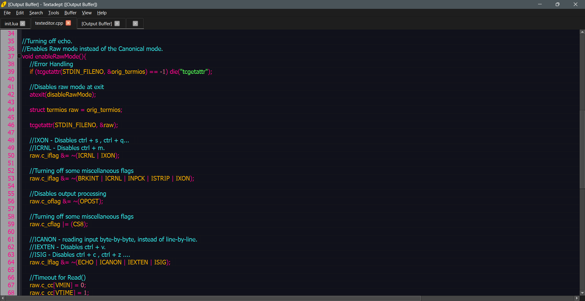

# Blossom Theme for Textadept

## Preview



## Installation
1. Clone the repository
```git clone https://github.com/BlossomTheme/Textadept```

2. Copy ```blossom.lua``` to:
```
    Your ~/.textadept/themes/ directory.
    Textadept’s themes/ directory.
```
> Tip: placing themes in your user data directory avoids the possibility of you overwriting them when you update Textadept. These themes also take precedence over the ones installed with Textadept.

3. Open ```init.lua``` using ```Edit > Preferences```

4. Add this to it:
```lua
if not CURSES then
	view:set_theme('blossom', {font = 'Monospace', size = 12})
	-- You can alternatively use the following to keep the default theme:
	-- view:set_theme{font = 'Monospace', size = 12}
end

-- Color Java class names black instead of the default yellow.
events.connect(events.LEXER_LOADED, function(name)
	if name ~= 'java' then return end
	local default_fore = view.style_fore[view.STYLE_DEFAULT]
	view.style_fore[buffer:style_of_name(lexer.CLASS)] = default_fore
end)
```
5. Restart or reset Textadept
6. Enjoy